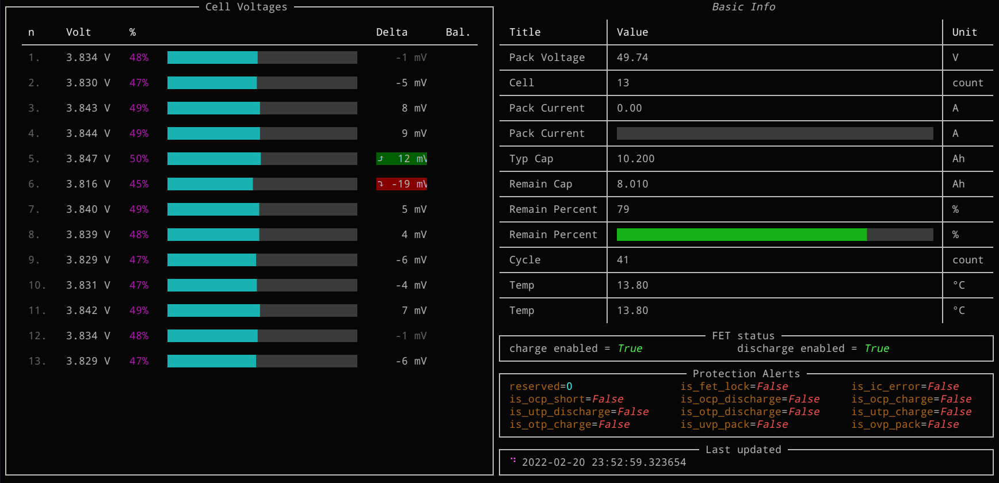

# BMS parser
Definitions for the generic smart battery managment system protocol. 
It is written with [Kaitai Struct](https://kaitai.io/), which can used to export parsers in different languages, some examples are in `py` for Python. `main.py` allows logging to a file or MongoDB instance, see the parameters.

`py/tui` contains a terminal based UI:


It depends on `rich`, `pyserial` and `kaitaistruct` (runtime) module. 
All of them can be installed with `pip install -r py/requirements.txt`, then it can be launched with:
```
python -m py.tui.main /path/to/tty
```

### Non Python Parsing
For other languages you can use the compiler, for example:
```terminal
$ cd kaitai
$ kaitai-struct-compiler -t java battery_management_system_protocol.ksy
```
(Options for -t: graphviz, csharp, rust, all, perl, java, go, cpp_stl, php, lua, python, nim, html, ruby, construct, javascript)

`dumps` contains DSView logic analyzer captures of the protocol. In `decoder/bms` includes a protocol decoder for DSView or sigrok Pulseview, you can try it out with the captures.

Read more about the protocol: https://blog.ja-ke.tech/2020/02/07/ltt-power-bms-chinese-protocol.html
